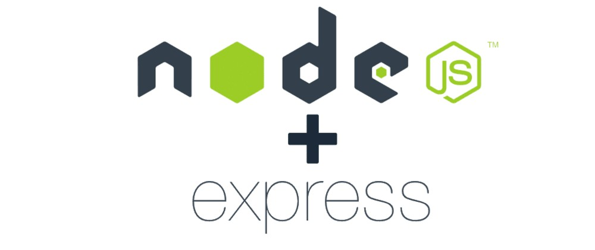

<div align="center"> 
    
</div>

<br>
<br>

## What is the project about?

This project was made to practice advanced NodeJS lessons.

---

# Technologies used
- [SQL](https://www.w3schools.com/sql/)
- [MySQL Workbench](https://www.mysql.com/products/workbench/)
- [NodeJS](https://nodejs.org/en/about/)
- [Express](https://expressjs.com/pt-br/)

#

# Developed skills
 - Entender o funcionamento da camada de Model;
 - Delegar responsabilidades específicas para essa camada;
 - Conectar sua aplicação com diferentes bancos de dados;
 - Estruturar uma aplicação em camadas;
 - Delegar responsabilidades específicas para cada parte do seu app;
 - Melhorar manutenibilidade e reusabilidade do seu código;
 - Entender e aplicar os padrões REST;
 - Escrever assinaturas para APIs intuitivas e facilmente entendíveis.
#

# Instruções

```bash
    # Clonar repositório

    $ git clone git@github.com:CrisSouzaMA/trybe-store-manager.git

    # Entrar no diretório

    $ cd trybe-node-store-manager

```

<br>
<br>
<br>

